# Silk-Road Marketplace

## Project Overview

Silk-Road is a second-hand marketplace application built as a project for the Advanced
Programming course. Users can post ads, search and browse other users' ads, chat with
sellers, add ads to their favorites, and rate sellers. There is also an admin panel for
reviewing and approving/rejecting ads.

The Silk Road Marketplace backend is a Spring Boot REST API for a classifieds marketplace.
It provides user authentication, advertisement creation and review, category and city management, chat messaging, favorites, ratings, image storage, and admin review functionality.

## Team Members and Individual Contributions


| Full Name | Username | Email | Contributions |
| --- | --- | --- | --- |
| Sajjad Heidari | silkroadwalker | sajjadheidari289@gmail.com | Majority of backend feature commits including authentication, advertisement and category management, chat, ratings, favorites, admin review, image upload handling, security, and Javadoc updates. |
| Fardad Shaghaghi | ferimuferi | ferimuferferi1205@gmail.com | All frontend and design including admin and user panels, graphical design and construction of effective connection between frontend and backend. Along with backend minor contribution. |

## Test Accounts

To use test accounts run the seed.sql located in backend/market/src/test/java/com/silkroad/market directory after running the project at least once. This way the database file is created and changes are commited to database. Test accounts are as follows:

| Username | Password | Role |
| --- | --- | --- |
| user | userpass | USER |
| user2 | user2pass | USER |
| admin | adminpass | ADMIN |

# Frontend (JavaFX Client)

## Technologies Used

- Java 21
- JavaFX 21 (UI) + SceneBuilder for FXML design
- Maven for build and dependency management
- Java `HttpClient` for communicating with the backend REST API
- Gson for JSON serialization/deserialization
- JWT-based authentication (token sent via the `Authorization: Bearer` header)

## Prerequisites

- JDK 21
- Maven 3.9+
- The backend (`backend/market`) is running on port `8080`, since the
  frontend has no data of its own and every screen pulls data from the backend.

## How to Run the Frontend

```bash
cd frontend
mvn clean javafx:run
```

⚠️ Note: always use the command above (from inside the `frontend` folder), not
IntelliJ's green Run button — running it that way causes a
`JavaFX runtime components are missing` error.

The backend address is hardcoded to `http://localhost:8080` (`ApiClient.java`), so if the
backend runs on a different port, that value must be changed manually in that file.

## Implemented Features

### Authentication
Sign up and login with backend-side validation, and storing the received JWT token.

> 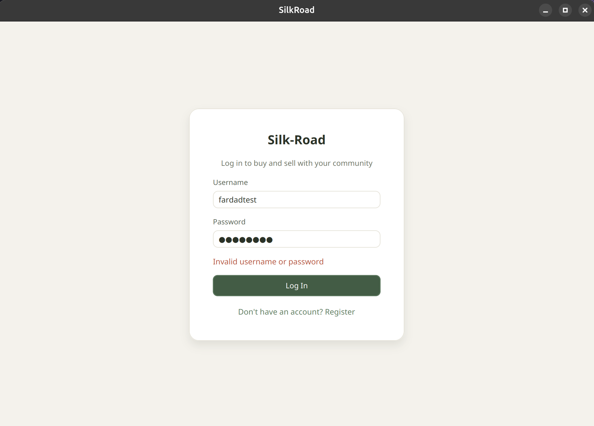

> 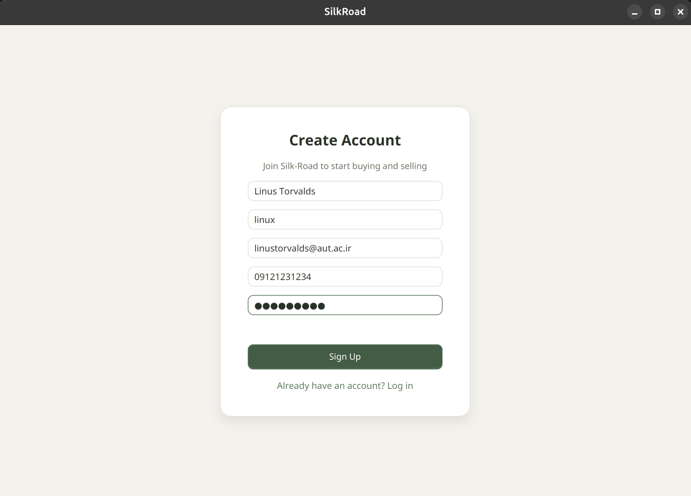

### Browsing and Searching Ads (Home)
Displays approved ads in a grid, with keyword search and sorting.

> 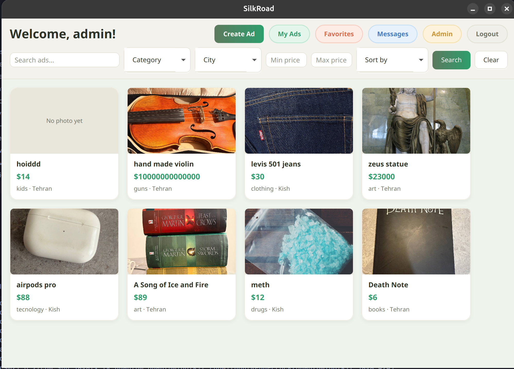

### Creating an Ad
Form for creating a new ad, with category (and subcategory), city, price, description, and multiple image uploads.

> 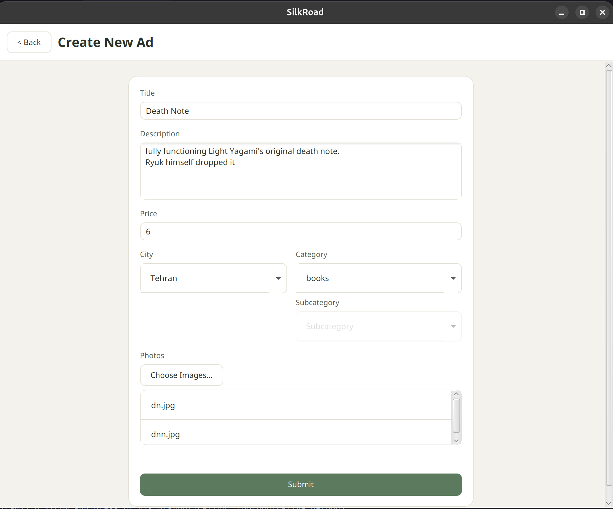

### Editing an Ad
Lets users edit their own ads.

> 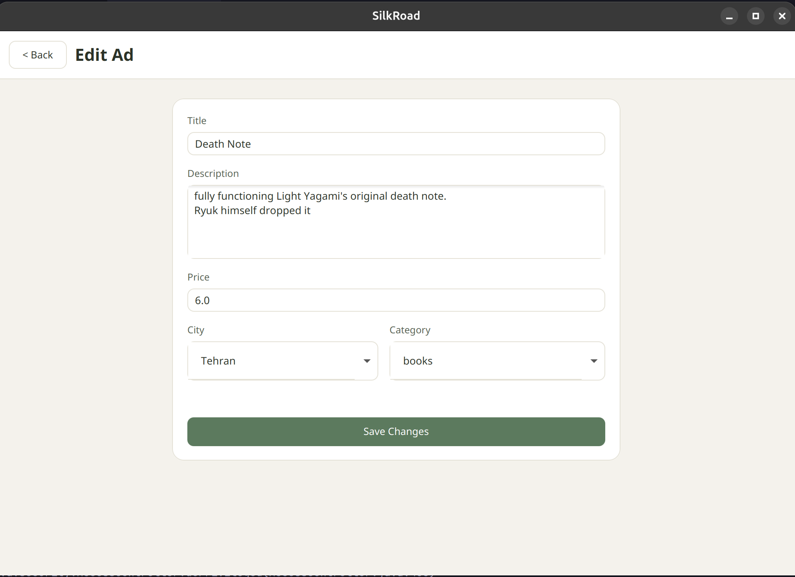

### Ad Details
Full view of a single ad, including images, seller info, seller rating, and buttons to start a chat / add to favorites.

>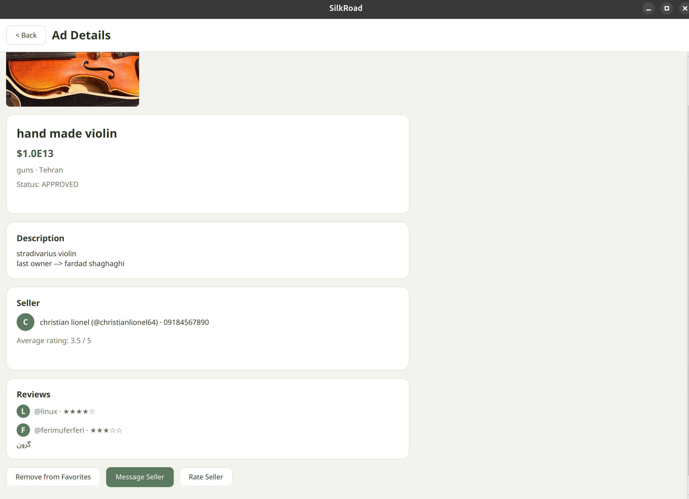

### My Ads
List of ads posted by the logged-in user, with status (Pending/Approved/Rejected/Sold).

> 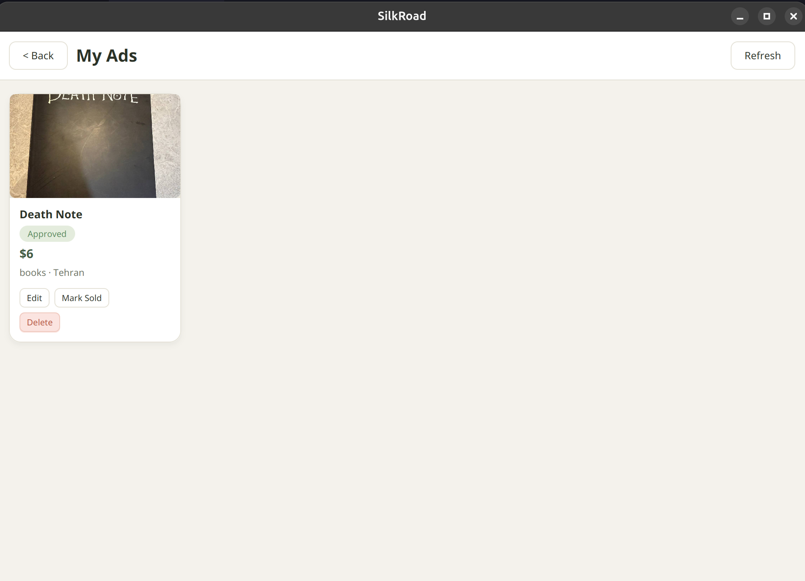

### Favorites
List of ads the user has added to favorites.

> 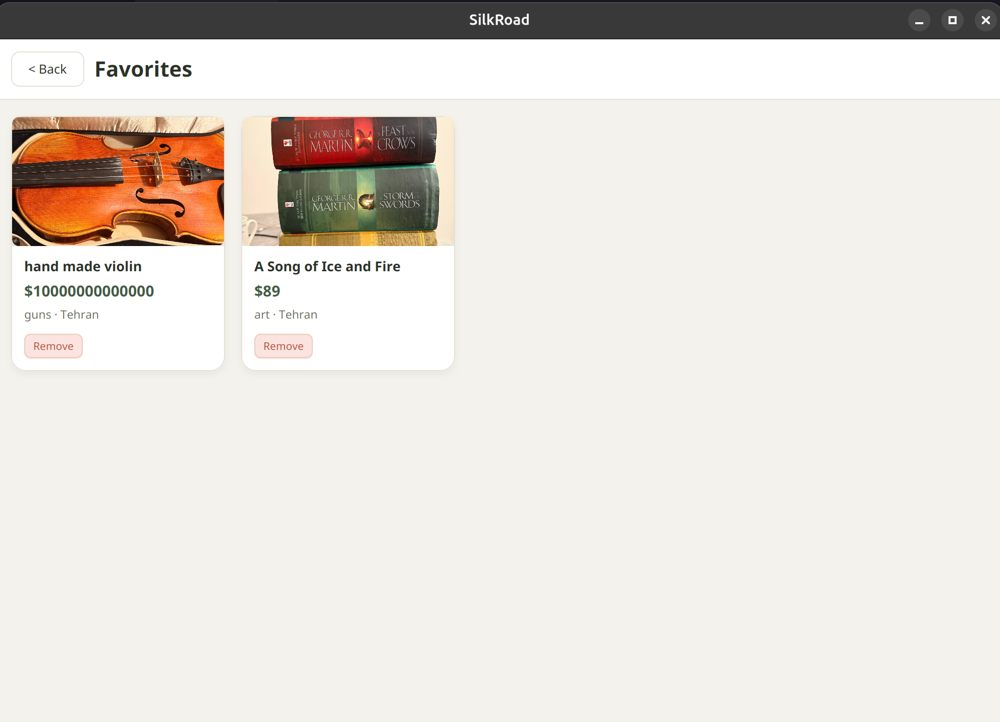

### Chat with Seller
List of conversations, and a chat screen for sending/receiving messages between buyer and seller.

> 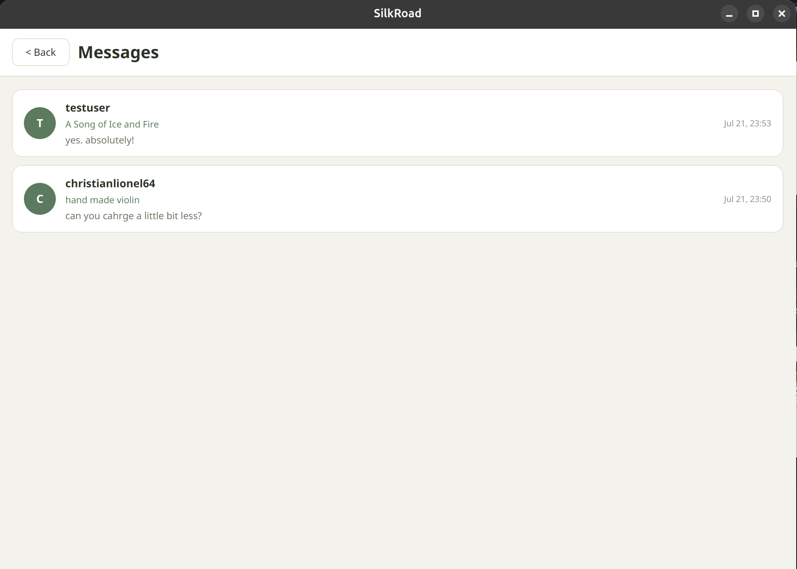

> 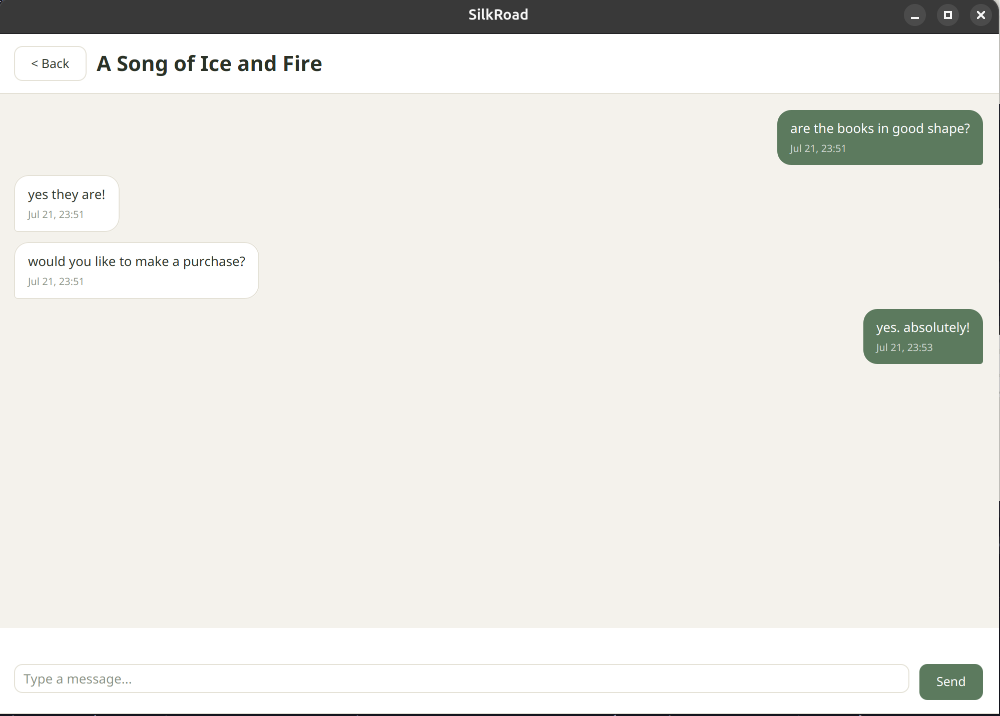

### Rating a Seller
Lets a user leave a rating and comment for a seller after a deal, and shows those ratings on the seller's profile/ad details.

> 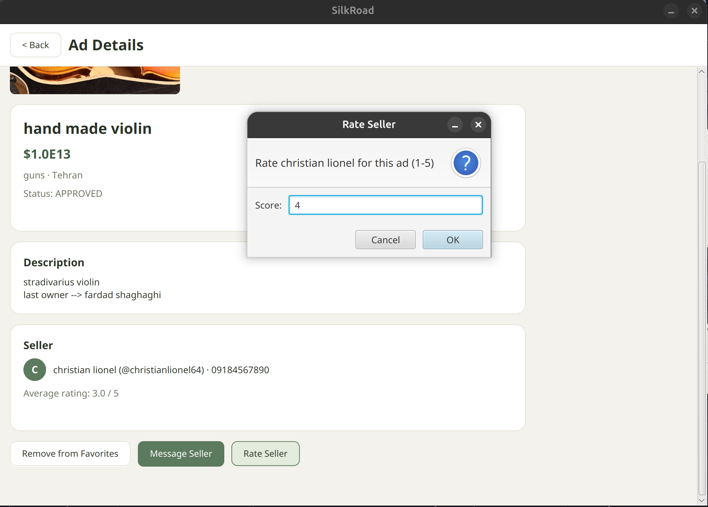

### Admin Panel
Lets an admin review pending ads and approve/reject them.

>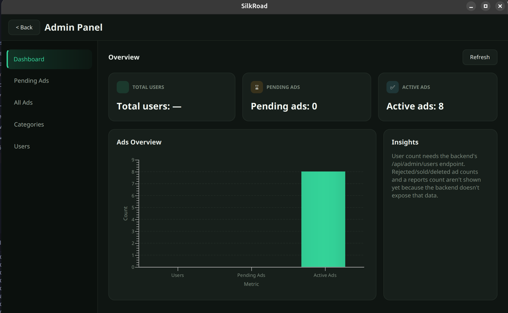

# Backend

Main technologies used:
- Java 17
- Spring Boot 4.1.0
- Spring Data JPA
- Spring Security with JWT
- SQLite via `sqlite-jdbc`
- Hibernate `SQLiteDialect`
- SpringDoc OpenAPI for Swagger UI
- Maven build system

## Backend Setup and Execution

### Prerequisites

- Java 17 SDK
- Maven 3.x
- Git

### Backend Project Location

The backend module is located at:

```bash
backend/market
```

### Build and Run

From the project root:

```bash
cd backend/market
mvn clean package
mvn spring-boot:run
```

Or run the packaged JAR:

```bash
cd backend/market
java -jar target/market-0.0.1-SNAPSHOT.jar
```

The backend starts on the default Spring Boot port `8080` and exposes APIs at:

```text
http://localhost:8080
```

### Configuration

The backend configuration is stored in:

```text
backend/market/src/main/resources/application.properties
```

Key properties:

```properties
spring.application.name=market
spring.datasource.url=jdbc:sqlite:project_db.sqlite
spring.datasource.driver-class-name=org.sqlite.JDBC
spring.jpa.database-platform=org.hibernate.community.dialect.SQLiteDialect
spring.jpa.hibernate.ddl-auto=update
spring.jpa.show-sql=true
```

No additional environment variables are required by the repository as provided. The database path is configured to a local SQLite file in the backend module.

## Data Preparation and Database Setup

### Database Type

- SQLite local database
- File path: `backend/market/project_db.sqlite`

### Initialization

The schema is created automatically by Hibernate using:

```properties
spring.jpa.hibernate.ddl-auto=update
```


### Notes

- The SQLite database file is ignored by Git via `.gitignore`.
- If the database needs to be reset, delete `backend/market/project_db.sqlite` and restart the backend.
- Uploaded images are saved to a local `uploads` directory created by the application at runtime.

## Implemented Features

### Authentication

- `POST /api/auth/signup` for user registration
- `POST /api/auth/login` for user login
- Password hashing with `BCryptPasswordEncoder`
- JWT token generation and validation

### Advertisement Management

- Create advertisements with uploaded images
- Search advertisements by keyword, category, city, min/max price
- Get advertisement details
- Update and delete owned advertisements
- Mark owned advertisements as sold
- View user's own advertisements
- Rating an advertisement
- Retrieve ratings for an advertisement

### Category Management

- Create categories (admin)
- List top-level categories
- List subcategories
- Update categories
- Delete categories if empty of subcategories
- One-level category nesting supported

### City Management

- Retrieve available cities

### Chat and Messaging

- Open new chat for an advertisement
- Retrieve chat list for authenticated user
- Reply in existing chat
- View chat messages

### Favorites

- Add advertisement to favorites
- Remove advertisement from favorites
- List favorite advertisements

### Image Handling

- Save uploaded advertisement images to local `uploads`
- Serve image resources through API
- Restrict image access to approved ads, ad owner, or admin

### Admin Features

- List pending advertisements
- View advertisement details as admin
- Approve or reject pending advertisements
- Dashboard statistics for users and ads
- List users

### Security

- Stateless JWT-based authentication
- Role-based authorization with `ROLE_ADMIN`
- CSRF disabled for API usage
- Permit public access to auth, documentation, and public GET endpoints

## System Architecture and Design

The backend follows a standard Spring Boot layered architecture:

- `controller`  HTTP REST controllers
- `service`  business logic and transaction handling
- `repository`  Spring Data JPA repositories
- `entity`  JPA entity model classes
- `dto`  request and response data transfer objects
- `security`  JWT and Spring Security configuration
- `config`  OpenAPI and application configuration

### Data Model

Key entities:

- `User`  registered user, role, status, favorites
- `Advertisement`  listing details, seller, category, city, status, images
- `Category`  category hierarchy with parent and subcategories
- `City`  city lookup data
- `Chat`  buyer-seller conversation thread for an advertisement
- `Message`  individual chat messages
- `Rating`  buyer rating of seller/ad
- `AdvertisementImage`  stored ad image metadata

### Architectural Notes

- The backend uses SQLite for lightweight local persistence.
- Hibernate automatically updates schema without manual migrations.
- Uploaded image files are stored on disk in `uploads` rather than in the database.
- The REST API is designed to be consumed by a JavaFX frontend on `http://localhost:8080`.

### Architecture Diagram

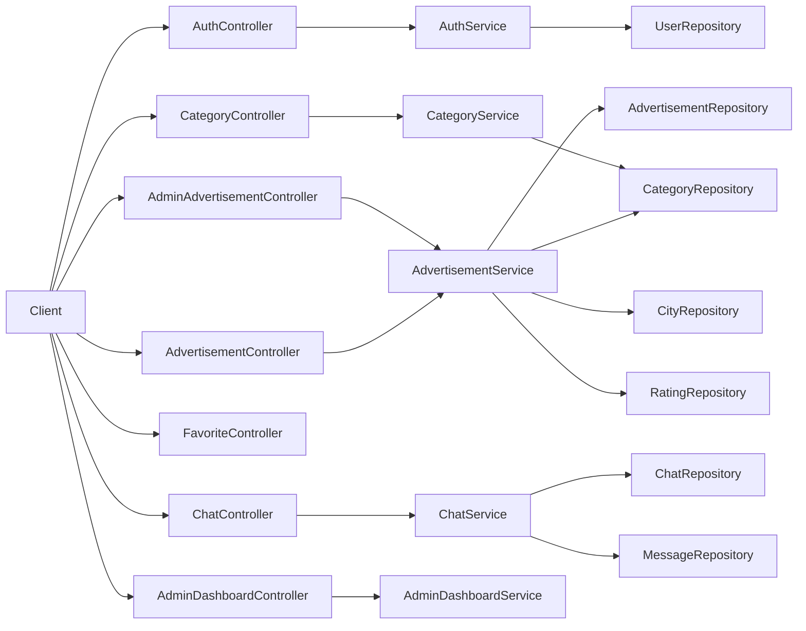

## Responsibilities and Deliverables of Each Team Member

### silkroadwalker

- Implemented backend functionality for authentication, ads, categories, search, chat, favorites, ratings, admin reviews, and security.
- Added backend models, repositories, services, controllers, and Javadoc updates.
- Delivered the core backend REST API and database integration.

### ferimuferi


- Assisted with backend-related project setup and integration work.

## Final Project Report

The backend for Silk Road Marketplace is a functioning Spring Boot service that supports user registration, JWT authentication, advertisement lifecycle management, category and city lookup, chat messaging, rating, favorites, and administrative ad review.

Major completed backend features:
- Auth with signup/login and JWT
- Ad creation with images, search, update, delete, and mark sold
- Chat and message threads for buyers and sellers
- Rating and retrieving ratings for advertisements
- Favorites support
- Admin review endpoints for pending ads and dashboard statistics
- Basic category and city management
- Local SQLite persistence with automatic schema creation


Overall, the backend delivers the main marketplace API platform but requires additional testing, admin account management, and production-grade persistence/seed tooling for full deployment readiness.
